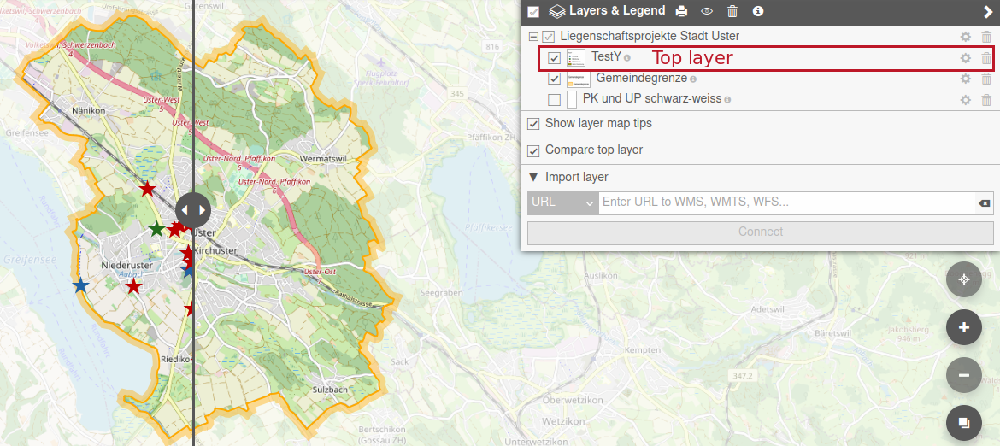
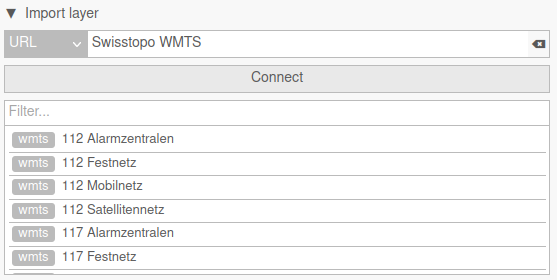
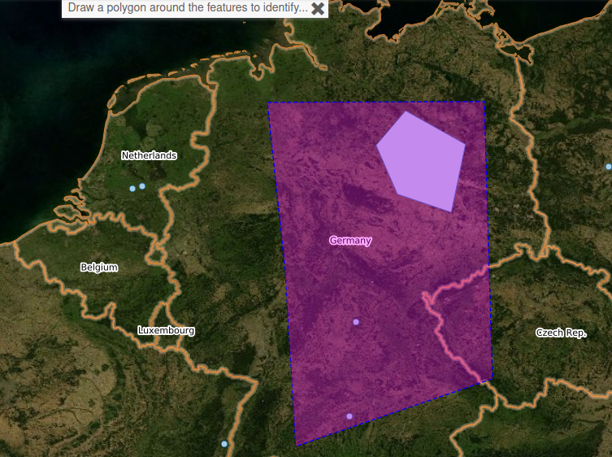
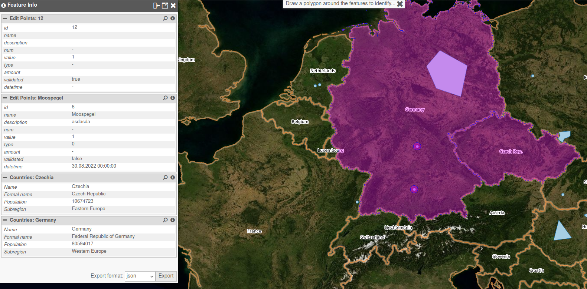
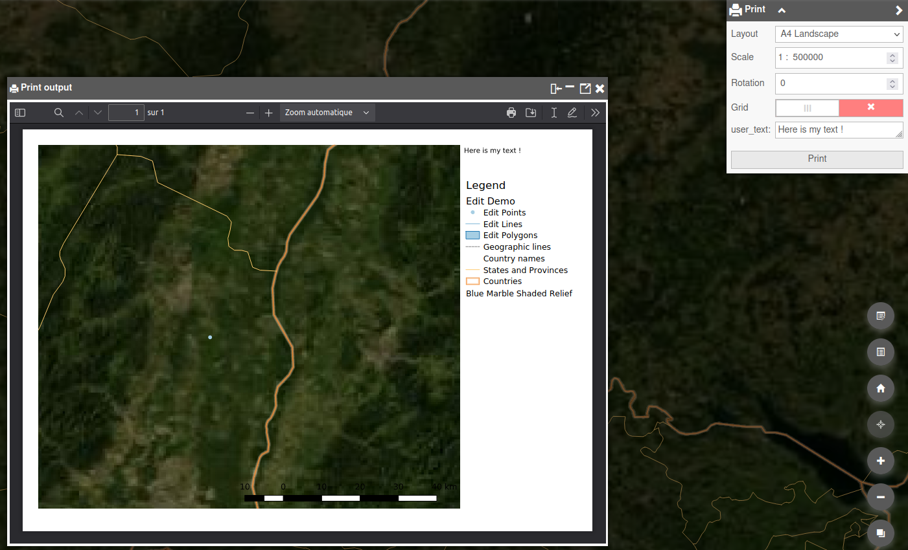

# User guide

This section contains user documentation of the QWC2 application and QWC services. It describes **some** of the available features.

*Note*: Depending on the specific viewer configuration, some functionalities might be missing or different than described in this section.

## Overview

QGIS Web Client is composed of some essential features for the user to be able to navigate through its GIS data.

The user interface is composed of :

1. a map : navigate through your GIS data, zoom, pan
2. a toolbar : configure some shortcuts for tools (none in this example)
3. a logo : customize your application with your company logo
4. a searchbar : search in the application according to configurable search providers
5. a menu : navigate through all the tools and features of the application
6. a scalebar : see what is the current scale of the map
7. a coordinates display according to the mouse position in several configurable CRS (Coordinates Reference System)
8. a drop-down list of scales : set the zoom of the map at a pre-defined scale
9. shortcuts : configure shortcut buttons for some features (Show Layer Tree for example)
10. home button : set the extent of the map at the home extent defined in your QGIS project
11. location button : zoom at the location of your device
12. zoom buttons : zoom in or out the map
13. a background switcher : change background layer among those configured in the application
14. attributions : links to the attributions data
15. terms of use : links to the terms of use of the application

## Basic features

### Menu

Here is a minimalist menu of the application with basic features :

#### Theme

*Theme* menu lists all the published QGIS projects in the application. One *theme* is linked to one *QGIS project*. You can switch from one to another by clicking on corresponding thumbnails. Then, the map is updated with data of the selected theme.

Themes can be sorted in groups.

You can also open a theme in a new tab, add a whole theme to the current map (to display several projects at the same time) or add some layers of a theme to the current one.

#### Layers & Legend

*Layers & Legend* menu allows user to show or hide any layer (or group of layers) on the map. Each layer comes from a published QGIS project (or *theme*), or from an external WMS/WFS, or local file.

On the top of this menu, you can print the legend of the displayed theme by clicking the *print* button. This will open a new window, where you can print this legend.

The *eye* button is used to filter layers that are not visible.

The *trash* button is used to remove all the layers displayed in the current map. You can retrieve layers from a QGIS project by selecting a theme in *Theme* menu.

The *i* button displays a new window with all the informations about the current theme. These informations are retrieved from the QGIS project properties.

For each layer, user can:

* remove the layer by clicking the *trash* button. This removes the layer only for the current context of the user, not for all the users. If the layer comes from the QGIS project, you can retrieve the deleted one by selecting the theme in *Theme* menu.
* change the order of display, by clicking *up* and *down* arrows buttons
* change opacity with the slider
* zoom on the layer extent with the *magnifying glass* button
* display layer legend by hovering the image on the left of the layer name or by clicking the *i* button (new window displaying info about the layer retrieved from QGIS project)

The *Show layer map tips* option is used to display a tooltip when hovering an object on the map. It needs you have configured a map tip in layers properties.

The *Compare top layer* option splits the map into two parts. On the left side, top layer (in the tree) is displayed while it is not on the right side. You can move the slider on the map to see the differences between the two sides.

The *Import layer* submenu allows user to add some external data to the current map. You can configure some predefined URLs in the application. For example, *Swisstopo WMTS* is a predefined entry in the demo application which queries *https://wmts10.geo.admin.ch/EPSG/2056/1.0.0/WMTSCapabilities.xml*. You can also add other URLs that are not predefined in the application, *https://wxs.ign.fr/clc/geoportail/r/wms?SERVICE=WMS&VERSION=1.3.0&REQUEST=GetCapabilities* if you want to add french Corine Land Cover data. By clicking on connect, there is a list of data available from the entered URL and you can add some of the layers to your current map by clicking on them.

In the *Import layer* submenu, you can also import local files to the current map. Only some formats are supported (*GeoJSON*, *JSON*, *KML*).

#### Map Tools

In the *Map Tools* menu, user can retrieve some basic features of GIS webclient :
* identify objects
* measuring tools
* drawing tools
* export image

#### Identify

To identify an object and get attribute values, you can click directly on the map. If an object is present at the click position, there is a request sent to QGIS Server to get attributes of the clicked object. Results are displayed in a window with all objects identified. Geometry of queried objects are highlighted. You can zoom on an object extent, or browse results one by one in the *Feature Info* panel. Finally, you can export results of all identified objects (*JSON*, *GeoJSON*, *CSV* or *CSV + ZIP*).

To be able to query an object, layer must be configured as queryable in the QGIS project (check the *Identifiable* checkbox in *Project* &rarr; *Properties* &rarr; *Data Sources* in your QGIS project).

#### Identify Region

User can also use *Identify Region* tool to identify multiple objects in the same time. Draw a polygon around the features to identify to get the results.

### Measure

Measuring tools can be used to retrieve position, object length, object area, ... Values can be copied to clipboard with the *copy* button.

#### Position

Click on the map to get coordinates.

Coordinates are displayed according to selected CRS in bottom bar of the application (here *WGS 84 / Pseudo Mercator*).

#### Length

Draw a polyline on the map to measure the length of each segment and the sum of all these lengths.

User can choose the units of measurement (*meters*, *feet*, *kilometers*, *miles*).

#### Area

Draw a polygon on the map to measure an area.

User can choose the units of measurement (*square meters*, *square feet*, *square kilometers*, *square miles*, *hectares*).

#### Bearing

Draw a line on the map to get the bearing angle of this line (angle from start point to end point).

#### Redlining

In *Redlining* tool, user can add some annotations to the map in different temporary layers. The default layer in which you can add annotations is named *Redlining*. You can add new layers by clicking *+* button. Drawing layers are available in *Layers & Legend* menu.

Drawing options are :
* point
* polyline
* polygon
* circle
* text

For each object, you can set border color, fill color, size. Fill the *label* entry to set text on your object.

Once you have drawn objects, you can edit them by picking one and change options. Pick an object and click on *trash* button to delete it.

*Buffer* option is used to create a buffer around the selected object.

#### Raster Export

*Raster Export* tool allows the user to export a screenshot of the map in an image (*png*, *jpeg*) at a specified resolution (*96 dpi*, *300 dpi*). Draw a rectangle on the map to export a region in an image.

An image is opened in a new tab and you can save it on your computer with the specified format and resolution.

#### Print

With *Print* menu, you can export a layout configured in your QGIS project as PDF file. When clicking on the menu, a list of all available layouts of the *theme* (QGIS project) is displayed. You can set some options : scale, rotation, grid and custom text (if configured in the layout). Result is displayed in a new tab or in a window in the application. Then, you can save it in a file or print it.

#### Help

By default, *Help* menu displays the build date of the application. You can also customize this menu to have a link to the QWC User documentation.

#### External Link

*External Link* menu can be used to have a link to other resources. For example, your company site.
