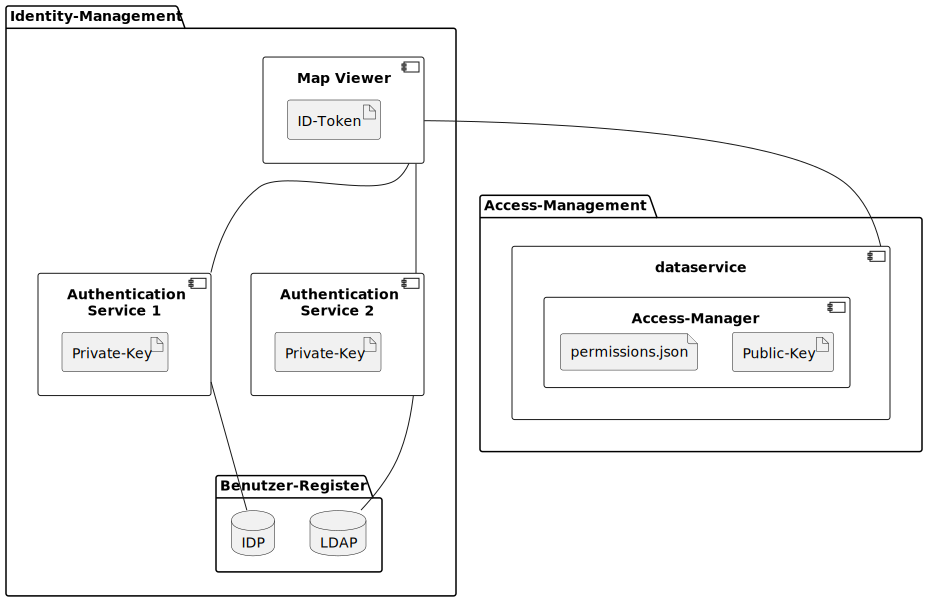

# Authentication

## Authentication Service

An authentication service uses a specific user identity store (e.g. DB, LDAP) or interacts with an Identity Provider (IdP) to confirm the user's identity. The service issues the JWT token, signs the token with a JWT secret key and transfers it to the web client.

QWC provides several authentication services:

- [Database Authentication Service](../../references/qwc-db-auth_readme/): Authenticates users against a database.
- [LDAP Authentication Service](../../references/qwc-ldap-auth_readme/): Authenticates users against an LDAP server.
- [OpenID Connect Authentication Service](../../references/qwc-oidc-auth_readme/): Authenticates users against OIDC providers like Keycloak, AD, etc.

### Access management

qwc-services-core library:

  * Verifies the signature of the JWT token with the JTW secret key
  * Ensures that the JWT token has not expired
  * Extract permissions of a user from `permissions.json`

QWC Service:

  * Uses `qwc-services-core` to read the permissions of the current user
  * Handles user permissions for certain resources (maps, layers, etc.)

## Artifacts

### JWT token

Token with a common structure between different authentication services, which contains the user name of the user logged in to the IDP.

The JWT token is usually transferred as part of the session cookie.

### permissions.json

Contains information about which users have read and write access to which layers.

## IAM example

Using the example of the Map Viewer, the Data Service, and the Authentication Services, the diagram explains how identity and access management works in conjunction with the various components of the QWC.

### Map Viewer

Web GIS component running in the browser. Retrieves an JWT token from the Authentication Service for the user and then uses it when communicating with the Data Service. Retrieves a new token when the currently used token expires.

Oauth2 role: Client

### Authentication Service

Issues the singed JWT token and returns it to the Map Viewer.

Oauth2 role: Authorization Server (authentication part).

Of the two tasks of authentication and authorization performed by an authorization server, the AS performs only authentication.

### Data Service

* Uses `qwc-services-core` to read the permissions of the current user.
* Checks whether access to the layer is permitted for the user ID in the JWT token.
* Then accesses the layer in read/write mode.

Oauth2 role: Resource server
